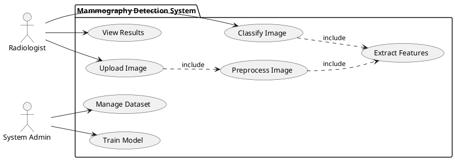
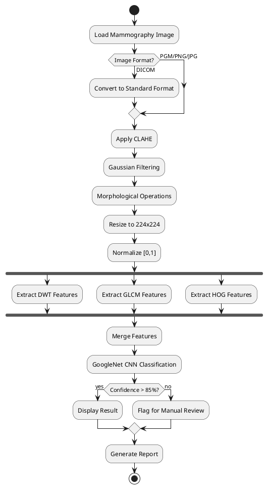
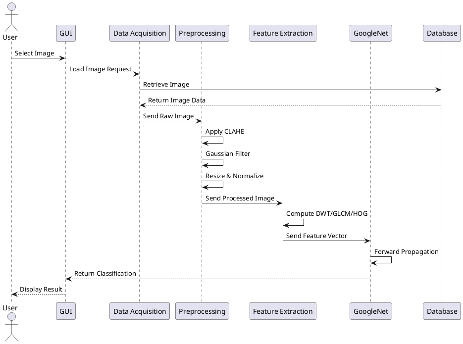

# 📐 UML Diagrams

This folder contains UML diagrams from the B.Tech project report (Chapter 4.2).

## Diagrams from Report

### Fig 4.1: Use Case Diagram (Page 35)

**Description:**
The Use Case diagram illustrates the interactions between different actors and the mammography detection system.

**Key Components:**
- **Actors:**
  - Radiologist (Primary user)
  - System Administrator
  - Database
  
- **Use Cases:**
  - Upload Mammography Image
  - Preprocess Image (CLAHE, Gaussian Filter, Morphological Operations)
  - Extract Features (DWT, GLCM, HOG)
  - Train Model (GoogleNet CNN)
  - Classify Image
  - View Results
  - Generate Report
  - Manage Dataset
  - Configure System Parameters

**Relationships:**
- "include" relationships between preprocessing and feature extraction
- "extend" relationships for optional advanced analysis
- Association links between actors and use cases

**File:** `use_case_diagram.png` (Original from report)

---

### Fig 4.2: Activity Diagram (Page 36)

**Description:**
The Activity diagram shows the workflow of the mammography classification process from image input to final diagnosis.

**Process Flow:**

1. **Start** → System Initialization
2. **Load Image** → MIAS dataset or new mammogram
3. **Decision:** Image Format Check
   - If DICOM → Convert to standard format
   - If PGM/PNG/JPG → Proceed
4. **Preprocessing:**
   - Apply CLAHE for contrast enhancement
   - Gaussian filtering for noise reduction
   - Morphological operations (closing/opening)
   - Resize to 224×224 pixels
   - Normalize to [0,1] range
5. **Feature Extraction:**
   - Parallel Activities:
     - DWT (Discrete Wavelet Transform)
     - GLCM (Gray Level Co-occurrence Matrix)
     - HOG (Histogram of Oriented Gradients)
   - Merge extracted features
6. **Classification:**
   - Feed features to GoogleNet CNN
   - Apply softmax for probability distribution
7. **Decision:** Confidence Threshold
   - If confidence > 85% → Display result
   - If confidence < 85% → Flag for manual review
8. **Output:**
   - Display tissue density classification
   - Show confidence scores
   - Generate visualization
9. **End**

**Swim Lanes:**
- User Interface
- Preprocessing Module
- Feature Extraction Module
- Deep Learning Model
- Database

**File:** `activity_diagram.png` (Original from report)

---

### Fig 4.3: Sequence Diagram (Page 37)

**Description:**
The Sequence diagram depicts the interactions between system components over time during the classification process.

**Objects/Actors:**
1. **User Interface (GUI)**
2. **Data Acquisition Module**
3. **Preprocessing Module**
4. **Feature Extraction Module**
5. **GoogleNet Model**
6. **Database**
7. **Results Display Module**

**Sequence of Interactions:**

```
1. User → GUI: Select Image
2. GUI → Data Acquisition: Load Image Request
3. Data Acquisition → Database: Retrieve Image
4. Database → Data Acquisition: Return Image Data
5. Data Acquisition → Preprocessing: Send Raw Image
6. Preprocessing → Preprocessing: Apply CLAHE
7. Preprocessing → Preprocessing: Gaussian Filter
8. Preprocessing → Preprocessing: Morphological Ops
9. Preprocessing → Preprocessing: Resize & Normalize
10. Preprocessing → Feature Extraction: Send Processed Image
11. Feature Extraction → Feature Extraction: Compute DWT
12. Feature Extraction → Feature Extraction: Compute GLCM
13. Feature Extraction → Feature Extraction: Compute HOG
14. Feature Extraction → GoogleNet: Send Feature Vector
15. GoogleNet → GoogleNet: Forward Propagation
16. GoogleNet → GoogleNet: Softmax Classification
17. GoogleNet → Results Display: Return Prediction
18. Results Display → Database: Store Results
19. Database → Results Display: Confirmation
20. Results Display → GUI: Display Classification
21. GUI → User: Show Result (Fatty/Glandular/Dense)
```

**Time Annotations:**
- Image Loading: ~0.5s
- Preprocessing: ~1-2s
- Feature Extraction: ~2-3s
- CNN Inference: ~0.5-1s
- Total Time: ~4-7s per image

**File:** `sequence_diagram.png` (Original from report)

---

## Additional Architecture Diagrams

### Fig 3.7: System Architecture Diagram (Page 29, Chapter 3.3)

**Description:**
Complete system architecture showing data flow from input to output.

**Components:**
- Input Layer (MIAS Dataset)
- Preprocessing Pipeline
- Feature Extraction Layer
- GoogleNet CNN Architecture
- Classification Output Layer
- Evaluation Metrics Display

**File:** `architecture_diagram.png` (Original from report)

---

## How to View/Add Diagrams

### Option 1: Add Original Images
If you have the original report diagrams:
```bash
# Place your diagram images in this folder
cp path/to/use_case_diagram.png diagrams/
cp path/to/activity_diagram.png diagrams/
cp path/to/sequence_diagram.png diagrams/
cp path/to/architecture_diagram.png diagrams/
```

### Option 2: Recreate Using PlantUML

You can recreate these diagrams using PlantUML syntax:

**Use Case Diagram:**


**Activity Diagram:**


**Sequence Diagram:**


### Option 3: Use Draw.io/Lucidchart

Recreate diagrams using online tools:
- [Draw.io](https://app.diagrams.net/)
- [Lucidchart](https://www.lucidchart.com/)
- [PlantUML Online](http://www.plantuml.com/plantuml/)

---

## Directory Structure

```
diagrams/
├── README.md (this file)
├── use_case_diagram.png (Fig 4.1)
├── activity_diagram.png (Fig 4.2)
├── sequence_diagram.png (Fig 4.3)
├── architecture_diagram.png (Fig 3.7)
└── plantuml/ (optional)
    ├── use_case.puml
    ├── activity.puml
    └── sequence.puml
```

---

## Diagram Descriptions Summary

| Diagram | Figure | Page | Description |
|---------|--------|------|-------------|
| Use Case Diagram | Fig 4.1 | 35 | System interactions and user roles |
| Activity Diagram | Fig 4.2 | 36 | Workflow from input to classification |
| Sequence Diagram | Fig 4.3 | 37 | Component interactions over time |
| Architecture Diagram | Fig 3.7 | 29 | Complete system architecture |

---

## Notes

- All diagrams are originally from the B.Tech project report
- Diagrams illustrate the system design from Chapter 4 (Modules)
- These represent the planned and implemented system architecture
- For full context, refer to the B.Tech project report

---

## Related Documentation

- See `../src/` for actual implementation
- See `../matlab/gui.m` for MATLAB GUI implementation
- See main `README.md` for project overview
